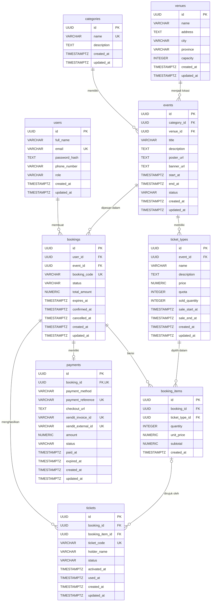

# LilTicket

LilTicket adalah platform pemesanan tiket event/konser berbasis web. Project ini menggunakan frontend React dan backend Express, dengan dukungan autentikasi, dashboard admin, pemesanan tiket, pembayaran Xendit test mode, e-ticket, QR Code, dan check-in tiket.

Project ini dibuat sebagai aplikasi tugas React Lanjutan dengan pemisahan frontend dan backend, integrasi database PostgreSQL/Supabase, serta flow booking sampai validasi tiket.

## Fitur Utama

### Customer

- Register dan login
- Melihat daftar acara
- Search, filter, sorting, dan pagination acara
- Melihat detail acara
- Memilih tiket
- Membuat booking
- Melakukan pembayaran via Xendit invoice
- Melihat status pesanan
- Melihat e-ticket dan QR Code

### Admin

- Dashboard admin
- Kelola kategori
- Kelola venue
- Kelola acara
- Kelola jenis tiket
- Kelola pesanan
- Check-in tiket/validasi QR

### Payment

- Integrasi Xendit test mode
- Webhook payment
- Status pembayaran `PAID`, `EXPIRED`, dan `FAILED`
- Booking menjadi `CONFIRMED` setelah payment `PAID`

## Tech Stack

### Frontend

- React
- Vite
- pnpm
- Tailwind CSS
- React Router
- Lucide React
- Framer Motion
- qrcode.react

### Backend

- Node.js
- Express.js
- PostgreSQL
- Supabase
- JWT
- httpOnly Cookie
- CORS
- bcrypt
- Xendit
- ngrok untuk webhook local testing

## Struktur Folder

```text
lilticket/
|-- frontend/
|   |-- src/
|   |   |-- components/
|   |   |-- context/
|   |   |-- hooks/
|   |   |-- layouts/
|   |   |-- pages/
|   |   |-- services/
|   |   `-- utils/
|   |-- public/
|   `-- package.json
|-- backend/
|   |-- src/
|   |   |-- controllers/
|   |   |-- middleware/
|   |   |-- routes/
|   |   |-- scripts/
|   |   |-- services/
|   |   |-- sql/
|   |   |   `-- schema.sql
|   |   |-- app.js
|   |   `-- server.js
|   `-- package.json
|-- package.json
`-- pnpm-workspace.yaml
```

- `frontend/`: aplikasi React Vite.
- `backend/`: aplikasi API Express.
- `backend/src/routes`: definisi route API.
- `backend/src/controllers`: logic request/response untuk setiap fitur.
- `backend/src/services`: helper/service backend.
- `backend/src/middleware`: middleware auth, admin, error, dan not found.
- `backend/src/sql/schema.sql`: schema database PostgreSQL.

## Cara Menjalankan Project

1. Clone repo.

```bash
git clone <repo-url>
cd lilticket
```

2. Install dependency backend.

```bash
cd backend
pnpm install
pnpm dev
```

3. Install dependency frontend di terminal lain.

```bash
cd frontend
pnpm install
pnpm dev
```

4. Alternatif dari root project:

```bash
pnpm dev:backend
pnpm dev:frontend
```

Backend berjalan di `http://localhost:5055`, sedangkan frontend berjalan di `http://localhost:5173`.

## Environment Variables

Jangan menulis secret asli di dokumentasi atau commit repository. Gunakan file `.env.example` sebagai acuan lalu buat file `.env` lokal masing-masing.

### Frontend `.env` example

```env
VITE_API_URL=http://localhost:5055/api
```

### Backend `.env` example

```env
PORT=5055
DATABASE_URL=postgresql://...
JWT_SECRET=...
JWT_EXPIRES_IN=...
FRONTEND_URL=http://localhost:5173
XENDIT_SECRET_KEY=...
XENDIT_WEBHOOK_TOKEN=...
PUBLIC_BACKEND_URL=https://your-ngrok-url.ngrok-free.app
```

## Database

Database menggunakan PostgreSQL/Supabase. Schema utama berada di `backend/src/sql/schema.sql`.

Tabel utama:

- `users`
- `categories`
- `venues`
- `events`
- `ticket_types`
- `bookings`
- `booking_items`
- `payments`
- `tickets`

### ERD



- `users` menyimpan akun customer/admin.
- `categories` menyimpan kategori acara.
- `venues` menyimpan lokasi acara.
- `events` menyimpan data acara.
- `ticket_types` menyimpan jenis tiket per acara.
- `bookings` menyimpan pesanan.
- `booking_items` menyimpan detail tiket yang dipesan.
- `payments` menyimpan status pembayaran.
- `tickets` menyimpan e-ticket/QR code.

## Alur Sistem

1. User register/login.
2. User memilih event.
3. User memilih tiket.
4. Sistem membuat booking.
5. User diarahkan ke invoice Xendit.
6. Xendit mengirim webhook.
7. Backend update payment menjadi `PAID`.
8. Backend update booking menjadi `CONFIRMED`.
9. Backend membuat e-ticket.
10. User melihat QR Code.
11. Admin melakukan check-in tiket.

## Endpoint Ringkas

Base URL API: `http://localhost:5055/api`

### Auth

- `POST /auth/register` - register customer.
- `POST /auth/login` - login user dan set cookie auth.
- `POST /auth/logout` - logout user.
- `GET /auth/me` - mengambil data user login.

### Events

- `GET /events` - daftar event.
- `GET /events/:id` - detail event.
- `GET /events/admin/all` - daftar event untuk admin.
- `POST /events` - membuat event baru, admin only.
- `PUT /events/:id` - update event, admin only.
- `DELETE /events/:id` - hapus event, admin only.

### Bookings

- `POST /bookings` - membuat booking, auth required.
- `GET /bookings/my` - daftar booking milik user login.
- `GET /bookings/:id` - detail booking.
- `GET /bookings/:bookingId/tickets` - tiket dari booking tertentu.
- `GET /bookings/admin/all` - daftar semua booking, admin only.

### Payments

- `POST /payments/xendit/create` - membuat atau mengambil Xendit invoice untuk booking.
- `POST /payments/xendit/webhook` - menerima webhook Xendit.

### Tickets

- `GET /tickets/my` - daftar tiket milik user login.
- `GET /tickets/code/:ticketCode` - detail tiket berdasarkan kode tiket.
- `GET /tickets/:ticketId` - detail tiket berdasarkan id.
- `POST /tickets/check-in` - check-in tiket, admin only.

### Admin

- `GET /admin/dashboard` - ringkasan dashboard admin.
- `GET /admin/bookings` - daftar booking admin.
- `POST /admin/check-in` - check-in tiket melalui endpoint admin.

### Check-in

- `POST /tickets/check-in` - validasi dan check-in tiket.
- `POST /admin/check-in` - alias check-in dari route admin.

### Categories

- `GET /categories` - daftar kategori.
- `POST /categories` - membuat kategori, admin only.
- `PUT /categories/:id` - update kategori, admin only.
- `DELETE /categories/:id` - hapus kategori, admin only.

### Venues

- `GET /venues` - daftar venue.
- `POST /venues` - membuat venue, admin only.
- `PUT /venues/:id` - update venue, admin only.
- `DELETE /venues/:id` - hapus venue, admin only.

### Ticket Types

- `GET /ticket-types` - daftar jenis tiket, admin only.
- `GET /ticket-types/event/:eventId` - jenis tiket berdasarkan event, admin only.
- `POST /ticket-types` - membuat jenis tiket, admin only.
- `PUT /ticket-types/:id` - update jenis tiket, admin only.
- `DELETE /ticket-types/:id` - hapus jenis tiket, admin only.

## Materi React yang Digunakan

Project ini menggunakan materi React Lanjutan berikut:

- Component
- Props
- State
- Event handling
- Conditional rendering
- List rendering
- Search/filter
- Sorting
- Pagination
- Editing
- Context API
- `useEffect`
- `useRef`
- `React.memo`
- `useMemo` dan `useCallback`
- `React.lazy`
- `Suspense`
- React Router
- Tailwind CSS
- Framer Motion

## Catatan Presentasi

Poin yang perlu dijelaskan saat presentasi:

- Relasi database
- Auth JWT dan cookie
- Middleware auth/admin
- Flow booking-payment-ticket
- Webhook Xendit
- QR Code dan check-in
- Optimasi React
- Tantangan saat pengerjaan

## Status Project

- Backend stabil
- Smoke test backend pernah 15/15 passed jika data seed dan server lokal tersedia
- Booking flow berjalan
- Xendit test mode berjalan
- Webhook berjalan via ngrok
- E-ticket dan QR Code tersedia
- UI memakai tema Warm Burgundy Premium

## Catatan Keamanan

- `.env` tidak boleh di-commit.
- Gunakan `.env.example` untuk contoh konfigurasi.
- Secret Xendit/JWT tidak boleh ditulis di README.
- Cookie auth memakai httpOnly.
